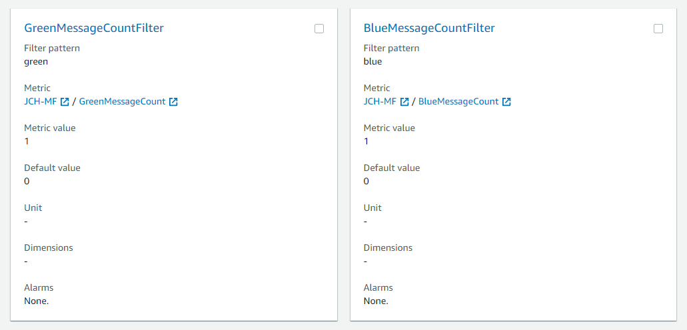
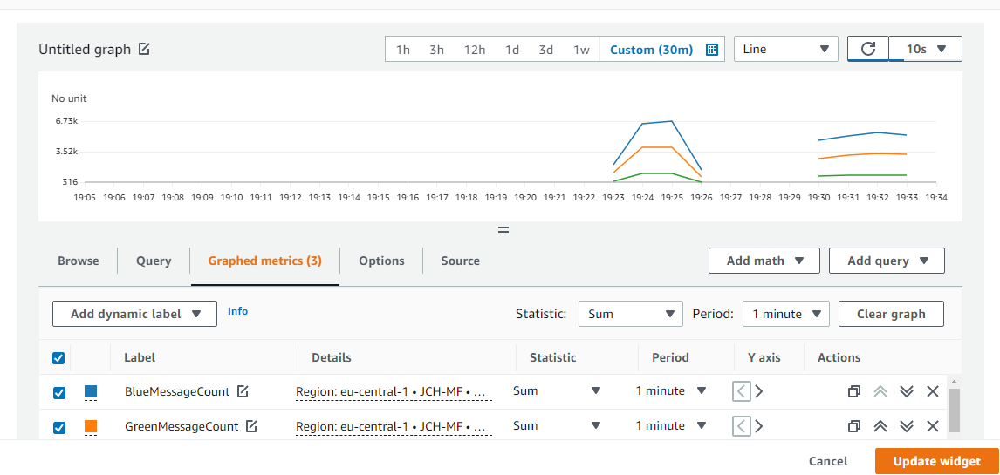

# CloudWatch Metrics

## Introduction
Collection of simple Python scripts demonstrating the functionality of CloudWatch Metrics, Alarms and Logs. Except of the AWS SDK for Python, the scripts do not depend on any other 3rd party modules/libraries.

The custom metrics generated by the scripts belong to the `JCH` namespace. The [commons.py](./commons.py) module provides functionality common to two or more scripts.

## How to Use the Scripts

### Generate Custom Metric Data
The [put-metric-data.py](./put-metric-data.py) script generates random values between 80 and 120 as custom metric. The following command illustrates how to run the script to generate 100 samples with period of 2 seconds.

```
put-metric-data.py 2 100
```

You can use the [get-metric-statistics.py](./get-metric-statistics.py) script to get metric statistics based on the radnom samples generated by the script above.

### Generate Custom Metric Data for Alarm
The [put-metric-data-for-alarm.py](./put-metric-data-for-alarm.py) script generates random values as custom metric according to a schedule specified by the given configuration file. The schedule prescribes the period (i.e. the break between two consecutive samples), and several batches of samples. For each batch, the number of samples as well as the range for the random values is prescribed.

The following command illustrates how to run the script using the [alarm-schedule.json](./alarm-schedule.json) configuration file.
```
put-metric-data-for-alarm.py alarm-schedule.json
```

The following AWS CLI command illustrates how to create an alarm that will go to `In Alarm` state if the average value of the metric generated by the above described script will exceed the threshold of 102 for at least 5 minutes. The value of the InstanceId dimension must be changed to the value generated by the script (the script writes the value to stdout shortly after the start).
```
aws cloudwatch put-metric-alarm --alarm-name RandomValueAlarm --namespace JCH --metric-name RandomValue --statistic Average --period 300 --evaluation-periods 1 --threshold 102 --comparison-operator GreaterThanOrEqualToThreshold --dimensions Name=InstanceId,Value=addfd3f9-fcc8-425c-ae7e-22482d3048db
```

The threshold and the period in the command above are appropriate for the schedule stored in the [alarm-schedule.json](./alarm-schedule.json) configuration file. The schedule defines totally 5 batches of metric data. The first, the third, and the fifth prescribe a range of values that will certainly be below the threshold 102. Therefore, these batches should not lead to any alarm. The second batch prescribes range of values that will most likely lead to average above the threshold for 8 minutes, so this batch should move the alarm to the `In Alarm` state. The fourth batch also prescribes range of values that will most likely lead to average above the threshold, but only for 3 minutes, so this is not enough to move the alarm to the `In Alarm` state. The following screenshot illustrates the values generated by the above mentioned schedule as well as the threshold for the alarm created by the above described AWS CLI command.


### Generate Log Events for Metric Filter
The [put-log-events-with-metric-filter.py](./put-log-events-with-metric-filter.py) script generates dummy log events for CloudWatch Logs. In addition, it also creates a metric filter the extracts custom metric data from the generated log events. The following command illustrates how to run the script.

```
put-log-events-with-metric-filter.py 2 300 50 80 [--no_filter]
```

The command above will generate 3 log events every 2 seconds, and it will generate 300 of such triplets. Within each triplet, there will two log events irrelevant for the metric filter, and one log event relevant for the metric filter. The events relevant for the metric filter will involve a random value between 50 and 80, which will be extracted by the metric filter. The `--no_filter` option allows to suppress the creation of the metric filter. It is optional - if omitted, the metric filter is created. The following screenshot illustrates the values generated by the above mentioned script.


The following screenshot illustrates the log events the metric originates from.


### Generate Log Events for Metric Filter Counting Log Messages
The [put-log-events-for-metric-filter-with-count.py](./put-log-events-for-metric-filter-with-count.py) script generates dummy log events for CloudWatch Logs. The script expects single command line argument, namely the number of log events to be generated. The events do not carry any numeric value, every log message contains one of the following three words representing colors: red, green, blue. The generated log events can be used to create metric filter that count the number of occurences of each color. The following screenshot illustrates the metric filters for two of the three colors.



When watching the metrics on a dashboard, use the sum statistics. As each log message generates the value 1, the sum statistics will generate the number of occurences. When generating the log messages, the script randomly picks the colors. However, the distribution of the colors is not equal. The blue color will have the highest number of occurences, the red color the lowest. The following screenshot shows the metrics produced by the metric filter.



The generated log events can also be used to experiment with CloudWatch Insights queries.

```
fields @timestamp, @message
| sort @timestamp desc
| limit 50


fields @timestamp, @message
| filter @message like /blue/

fields @timestamp, @message
| filter @message not like /polygon/


stats count(*)
| filter @message like /polygon/


fields @timestamp, @message
| filter @message like /green/ and @message like /circle/


fields @timestamp, @message
| filter @message like /green|blue/


fields @timestamp, @message
| filter @message not like /green|blue/


fields @timestamp, @message
| filter @message like /green|blue/ and @message like /circle|triangle/


fields @timestamp, @message
| filter @message =~ /green.+circle/ or @message =~ /blue.+triangle/


fields @timestamp, @message
| filter @message like /(?i)car/
```
