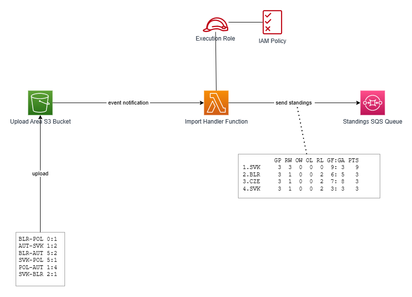

# S3 Event Notifications Demo

## Introduction
S3 Event Notifications Demo is an experimantal/educational serverless AWS application meant as illustration of S3 event notifications. The overall setup is depicted by the following diagram:


Lambda function (implemented in Python) is used as event handler for the S3 event notifications. Files uploaded to an S3 bucket are supposed to represent results of ice hockey games. Upload of such a file triggers the Lambda function which parses the game results, calculates standings based on the parsed game results, and sends the calculated standings to an SQS queue. The files with game results are expected in plain text with UTF-8 encoding. The following snippet illustrates the expected format of the game results (OT = overtime, SO = shootout).

```
RUS-CZE 4:3
BLR-SVK 2:5
DEN-SWE 4:3
GBR-RUS 1:7
CZE-SUI 2:5
GBR-SVK 1:2
SWE-BLR 0:1
DEN-SUI 0:1
SVK-RUS 3:1
CZE-BLR 3:2 OT
GBR-DEN 2:3 OT
SUI-SWE 0:7
RUS-DEN 3:0
BLR-GBR 3:4
SUI-SVK 8:1
SWE-CZE 2:4
SWE-GBR 4:1
DEN-BLR 5:2
CZE-GBR 6:1
SUI-RUS 1:4
SVK-DEN 2:0
BLR-SUI 0:6
SWE-SVK 3:1
CZE-DEN 2:1 SO
RUS-SWE 3:2 SO
SUI-GBR 6:3
SVK-CZE 3:7
RUS-BLR 6:0
```

The standings sent to the SQS queue are also in form of plain text sent as message body. The name of the S3 bucket and the name of the file with game results are also sent to SQS as message attributes. The following snippet illustrates the standings calculated from the game results from the snippet above. In other words, the snippet below illustrates the structure of the messages sent to SQS.

```
          GP RW OW OL RL GF:GA PTS
 1.RUS     7  5  1  0  1 28:10  17
 2.SUI     7  5  0  0  2 27:17  15
 3.CZE     7  3  2  0  2 27:18  13
 4.SVK     7  4  0  0  3 17:22  12
 5.SWE     7  3  0  1  3 21:14  10
 6.DEN     7  2  1  1  3 13:15   9
 7.GBR     7  1  0  1  5 13:31   4
 8.BLR     7  1  0  1  5 10:29   4

Legend
GP .... Games Played
RW .... Regulation Wins
OW .... Overtime + Shootout Wins
OL .... Overtime + Shootout Losses
RL .... Regulation Losses
GF .... Goals For
GF .... Goals Against
PTS ... Points
```

The calculation of standings, namely the tie-breaking procedure, is simplified - no head-to-head metric is used. If two or more teams are tied in points, the standing of the teams is determined in the following order:
- The greater differential between goals for and against.
- The greater ratio between goals for and against.

The [test-data](./test-data) directory contains several files with game results that can be used as test data.


## Source Code Organization
- The [event-handler.py](./event-handler.py) module contains the Lambda function used as event handler for the S3 notification. However, this module does not implement the business logic (i.e. parsing of game results, plus calculation and printing of standings). The business logic is implemented by other modules, and the [event-handler.py](./event-handler.py) module just integrates them into the Lambda execution environment.
- There is a bunch of modules which together implement the above mentioned business logic: [input.py](./input.py), [model.py](./model.py), [output.py](./output.py) and [standings.py](./standings.py).
- The [test.py](./test.py) module allows to test the business logic locally, without the Lambda execution environment. This module is in fact not a part of the application.
- The [setup-s3-notification.py](./setup-s3-notification.py) is also not a part of the application. It was used to test setup of the S3 event notification via the AWS SDK before embedding the Python code into the CloudFormation template (see [Deployment](#deployment) for more details).


## <a name="deployment"></a>Deployment
The project involves a CloudFormation template ([cloud-formation-template.yml](./cloud-formation-template.yml)) which simplifies the deployment. The CloudFormation template creates the entire stack (S3 bucket, event handler Lambda function with an appropriate execution role, SQS queue) and configures the S3 event notification so that a file upload to the S3 bucket triggers the event handler Lambda function. In order to deploy the application, follow these steps:
1. Compress all Python files except of [test.py](./test.py) and [setup-s3-notification.py](./setup-s3-notification.py) to a single flat ZIP file (no directory structure within the ZIP file).
2. Upload the ZIP file to an S3 bucket from which it will be taken by CloudFormation (the name of the bucket and the filename will have to be specified as parameter values when creating the stack).
3. Use the CloudFormation template [cloud-formation-template.yml](./cloud-formation-template.yml) to provision and configure all AWS resources comprising the application.

The following AWS CLI command illustrates how to use the CloudFormation template to create the stack.

```
aws cloudformation create-stack --stack-name Lambda-Ice-Hockey --template-body file://cloud-formation-template.yml --parameters file://stack-params.json --capabilities CAPABILITY_NAMED_IAM --on-failure ROLLBACK
```

As outlined above, the template involves several parameters. The [stack-params.json](./stack-params.json) file contains parameter values used during my experiments.

The configuration of the S3 event notification is a bit tricky as the notification cannot be configured when the S3 bucket is being created. Therefore, the CloudFormation template involves a custom resource in form of a Lambda function that uses the AWS SDK to setup the notification (see the S3NotificationConfiguration and S3NotificationConfiguratorFunction resources in the template). The Lambda function is implemented in Python directly in the CloudFormation template. For more details, look at the [AWS Documentation](https://aws.amazon.com/premiumsupport/knowledge-center/cloudformation-s3-notification-lambda/).
