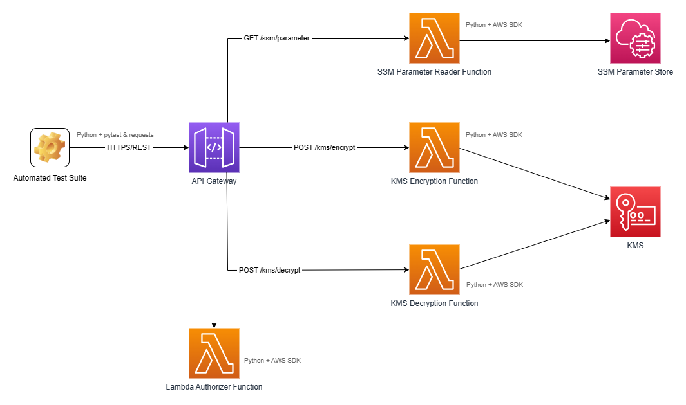

# API Gateway + Lambda Demo

## Introduction
Simple demonstration of API Gateway and Lambda. The API exposes three endpoints:
* `GET /ssm-paramater?name={ssm-param-name}` allows to read the value of the SSM parameter with the given name (the name of the SSM parameter is specified by a query string parameter).
* `POST /kms/encrypt` allows to encrypt the given plaintext with the KMS key with the given key ID.
* `POST /kms/decrypt` allows to decrypt the given ciphertext with the KMS key with the given key ID.

The Lambda functions are implemented in Python. The provisioning and configuration of the AWS resources is implemented in Terraform.

The overall setup is depicted by the following diagram:


## Terraform Variables
The following snippet illustrates the values of the Terraform variables used during my experiments.

```hcl
aws_region = "eu-central-1"

resource_name_prefix = "API-GW-Lambda-Demo"

tags = {
  Stack         = "API-GW-Lambda-Demo",
  ProvisionedBy = "Terraform"
}
```

## Manual Testing

`GET /ssm-paramater?name={ssm-param-name}`

`POST /kms/encrypt`
```json
{
    "plaintext": "Hello world!!!",
    "kmsKeyId": "a48a7295-7b9a-421a-9ba0-c6a78e39f873"
}
```

`POST /kms/decrypt`
```json
{
    "ciphertext": "AQICAHjWFp6RqVrJNjLbt2QWVzq2HLNk7wzp43c72NxPyxG6eQE+y8Tf+vVho4NZsgJhJGd6AAAAcjBwBgkqhkiG9w0BBwagYzBhAgEAMFwGCSqGSIb3DQEHATAeBglghkgBZQMEAS4wEQQMT64F5yW563mmONU6AgEQgC+u/yMj+zBbniFLjMW/yyxbW9aQ2psj9XY2jparsRcWFtpe1vB4p1sOJ2KArAIZjA==",
    "kmsKeyId": "a48a7295-7b9a-421a-9ba0-c6a78e39f873"
}
```


## Automated Tests
The automated test suite is available in the [tests](./tests) directory. It is implemented in Python, and it is based on [pytest](https://pypi.org/project/pytest/) and [requests](https://pypi.org/project/requests) 3rd party packages (see also [requirements.txt](./tests/requirements.txt)). The following command can be used to start the test suite (assumed the [tests](./tests) directory is the current directory, and the 3rd party packages have been installed).

```
pytest test_api.py
```

The test suite relies on the following environment variables:
* `API_GW_DEMO_INVOCATION_URL` defines the invocation URL of the API Gateway stage. This value is one of the outputs of the Terraform configuration.
* `API_GW_DEMO_KMS_KEY_ID` defines the ID of the KMS key to be used for encryption/decryption. The key is not created by Terraform, so you will have to create one manually.

Concerning the names and values of the SSM parameters, the automated test suite relies on the default values for the corresponding input variables for the Terraform configuration.
