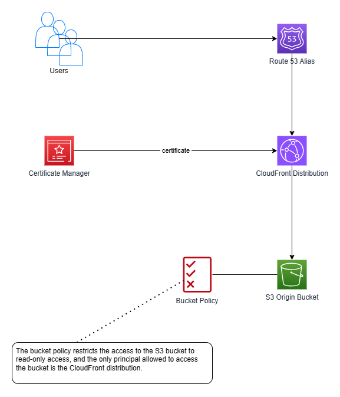

# CloudFront + S3 Origin Demo

## Introduction
Simple demonstration of CloudFront distribution with S3 origin. The CloudFront distribution is associated with a CloudFront Origin Access Control. The S3 bucket used as S3 origin has a bucket policy which restricts the access to the bucket to the Origin Access Control associated with the distribution. The overall setup is depicted by the following diagram:


The provisioning and configuration of the AWS resources is implemented in Terraform.

## Terraform Variables
The following snippet illustrates the values of the Terraform variables used during my experiments.

```hcl
aws_region = "us-east-1"

webcontent_bucket_name = "jardo72-cloudfront-s3-demo"

alias_hosted_zone_name = "jardo72.de."

dns_alias_fqdn = "cloudfront-s3-demo.jardo72.de"

acm_certificate_arn = "arn:aws:acm:us-east-1:467504711004:certificate/fc7ad407-00da-4071-828d-ead1f6297748"

resource_name_prefix = "CloudFront-S3-Demo"

tags = {
  Stack         = "CloudFront-S3-Demo",
  ProvisionedBy = "Terraform"
}
```
