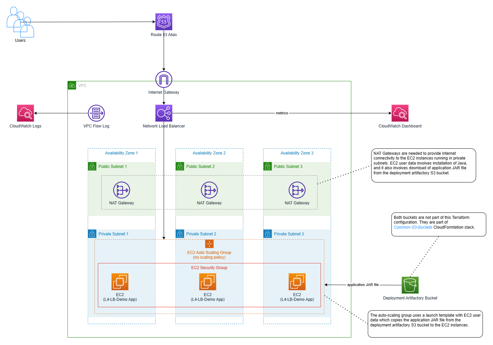

# L4 Load-Balancing Demo
Terraform deployment of the [L4 Load-Balancing Demo](../../L4-Load-Balancing) application. The overall setup is depicted by the following diagram:


The deployment relies on the deployment artifactory S3 bucket created by the [Common-S3-Buckets](../../Common-S3-Buckets) deployment.

The configuration is divided to the following modules:
* **vpc** module is responsible for provisioning of a VPC, its subnets, route tables, Internet Gateway and NAT Gateways.
* **nlb** module provisions an NLB, including NLB listener and target group.
* **asg** module is responsible for provisioning of an EC2 auto-scaling group. IAM instance profile for the EC2 instances as well as security group restricting network access to the EC2 instances are provisioned as well.
* **route53** module optionally provisions a Route 53 alias for the NLB.
* **cloudwatch** module creates a CloudWatch dashboard that visualizes some metrics for the EC2 auto-scaling group and the NLB.

The following snippet illustrates the values of variables used during my experiments:

```hcl
aws_region = "eu-central-1"

vpc_cidr_block = "10.0.0.0/16"

availability_zones = {
  "AZ-1" = {
    az_name                   = "eu-central-1a"
    private_subnet_cidr_block = "10.0.0.0/24"
    public_subnet_cidr_block  = "10.0.10.0/24"
  },
  "AZ-2" = {
    az_name                   = "eu-central-1b"
    private_subnet_cidr_block = "10.0.1.0/24"
    public_subnet_cidr_block  = "10.0.11.0/24"
  },
  "AZ-3" = {
    az_name                   = "eu-central-1c"
    private_subnet_cidr_block = "10.0.2.0/24"
    public_subnet_cidr_block  = "10.0.12.0/24"
  }
}

application_installation = {
  deployment_artifactory_bucket_name_export     = "CommonDeploymentArtifactoryBucketName"
  deployment_artifactory_access_role_arn_export = "CommonDeploymentArtifactoryReadAccessPolicyArn"
  deployment_artifactory_prefix                 = "L4-LB-DEMO"
  application_jar_file                          = "aws-sandbox-network-load-balancing-server-1.0.jar"
}

ec2_settings = {
  instance_type       = "t2.nano"
  port                = 1234
  healthy_threshold   = 2
  unhealthy_threshold = 2
}

nlb_port = 1234

route53_alias_settings = {
  enabled                = true
  alias_hosted_zone_name = "jardo72.de."
  alias_fqdn             = "nlb-demo.jardo72.de"
}

resource_name_prefix = "L4-LB-Demo"

tags = {
  Stack         = "L4-Load-Balancing-Demo"
  ProvisionedBy = "Terraform",
}

```
