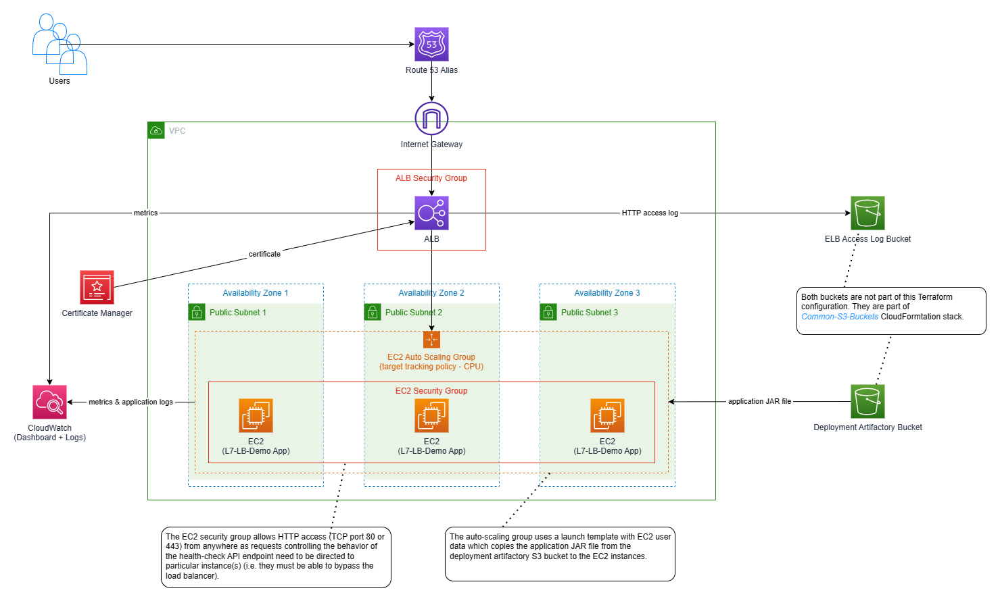

# L7 Load-Balancing Demo
Terraform deployment of the [L7 Load-Balancing Demo](../../L7-Load-Balancing) application. The overall setup is depicted by the following diagram:


This deployment relies on several buckets created by the [Common-S3-Buckets](../../Common-S3-Buckets) deployment. In concrete terms:
* it assumes the application JAR file is on a common S3 bucket serving as deployment artifactory
* in case of ALB access log is enabled, it also relies on a common S3 bucket serving as store for ELB access logs

The configuration is divided to the following modules:
* **vpc** module is responsible for provisioning of a VPC, its subnets, route table and Internet Gateway.
* **alb** module provisions an ALB, including ALB listener and target group. Security group restricting network access to the ALB is also provisioned by this module. Optionally, ALB access log can also be enabled/configured. The ALB listener can be configured to use HTTPS protocol and an ACM certificate.
* **asg** module is responsible for provisioning of an EC2 auto-scaling group with target-tracking policy which adapts the number of EC2 instances based on the aggregate CPU utilization for the entire auto-scaling group. IAM instance profile for the EC2 instances as well as security group restricting network access to the EC2 instances are provisioned as well. The EC2 instances use CloudWatch Agent to push the application logs to CloudWatch Logs.
* **route53** module optionally provisions a Route 53 alias for the ALB.
* **cloudwatch** module creates a CloudWatch dashboard that visualizes some metrics like CPU utilization for the EC2 auto-scaling group.

The following snippet illustrates the values of variables used during my experiments:

```hcl
aws_region = "eu-central-1"

vpc_cidr_block = "10.0.0.0/16"

availability_zones = {
  "AZ-1" = {
    az_name           = "eu-central-1a"
    subnet_cidr_block = "10.0.0.0/24"
  },
  "AZ-2" = {
    az_name           = "eu-central-1b"
    subnet_cidr_block = "10.0.1.0/24"
  },
  "AZ-3" = {
    az_name           = "eu-central-1c"
    subnet_cidr_block = "10.0.2.0/24"
  }
}

application_installation = {
  deployment_artifactory_bucket_name_export     = "CommonDeploymentArtifactoryBucketName"
  deployment_artifactory_access_role_arn_export = "CommonDeploymentArtifactoryReadAccessPolicyArn"
  deployment_artifactory_prefix                 = "L7-LB-DEMO"
  application_jar_file                          = "aws-sandbox-application-load-balancing-server-1.0.jar"
}

ec2_settings = {
  instance_type = "t2.small"
  port          = 8080
}

/* enable this if you want plain HTTP - in such case, disable the settings below which are meant for HTTPS
alb_settings = {
  port            = 80
  protocol        = "HTTP"
  certificate_arn = null
}
*/

alb_settings = {
  port            = 443
  protocol        = "HTTPS"
  certificate_arn = "arn:aws:acm:eu-central-1:467504711004:certificate/fae97c88-06af-4113-8537-adf2c080be97"
}

alb_access_log_settings = {
  bucket_name_export = "CommonELBAccessLogBucketName"
  prefix             = "L7-LB-Demo-Terraform"
  enabled            = true
}

autoscaling_group_settings = {
  min_size                         = 3
  max_size                         = 6
  desired_capacity                 = 3
  target_cpu_utilization_threshold = 50
}

route53_alias_settings = {
  enabled                = true
  alias_hosted_zone_name = "jardo72.de."
  alias_fqdn             = "alb-demo.jardo72.de"
}

resource_name_prefix = "L7-LB-Demo"

tags = {
  Stack         = "L7-Load-Balancing-Demo",
  ProvisionedBy = "Terraform"
}
```
