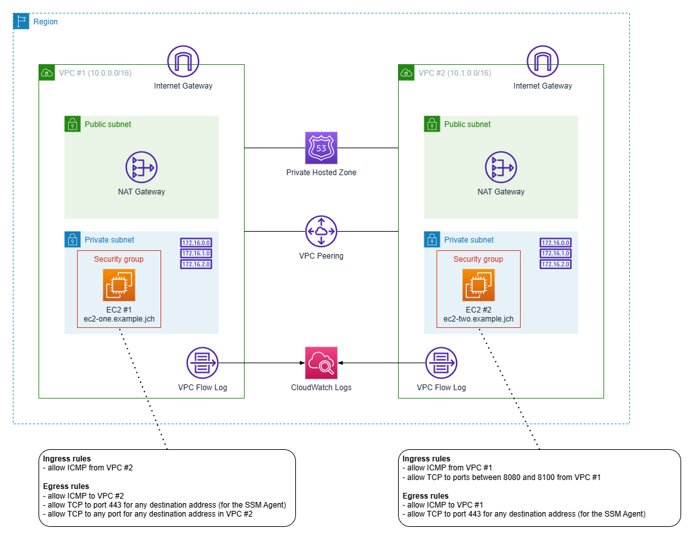

# VPC Peering with Private Route 53 Hosted Zone

## Introduction
Terraform configuration demonstrating:
* VPC peering
* Route 53 private hosted zones
* VPC flow logs

The configuration involves the following resources:
* Two VPCs (both in the same AWS account and the same AWS region) with non-overlapping CIDR blocks.
* Peering connection between the two VPCs, plus route tables configured to support traffic between the two VPCs.
* Two EC2 instances (one EC2 instance launched in each of the two VPCs). The EC2 user data script installs the ncat (aka nc) utility on both instances so it can be used to test the connectivity. Both EC2 instances are configured so that you can use the Session Manager feature of the Systems Manager to connect to them. Both EC2 instances use the ncat utility to open the port 80 and accept incoming connections (started by EC2 user data script).
* Two security groups, one for each of the two EC2 instances. ICMP traffic is allowed in both directions for both EC2 instances. TCP is only allowed from the instance #1 to the instance #2 (the other direction is blocked completely). The security group for the instance #1 allows any outbound TCP traffic (any port), the security group for the instance #2 only allows inbound traffic to the ports between 80 and 100. In other words, the setup allows to test various TCP scenarios (traffic accepted/rejected by security groups, outbound/inbound traffic, traffic to an open port in listening mode, traffic to an unused port etc.) in combination with VPC flow logs.
* Private hosted zone configured in Route 53. A-records for both EC2 instances (one record for each of the two EC2 instances). The hosted zone is associated with both VPCs, so when testing the conncectivity, you can use both private IP addresses of the EC2 instances and they custom DNS names generated and assigned by the Terraform configuration (not by AWS).
* VPC flow log for both VPCs (separate VPC flow log for each VPC). The flow logs are written to CloudWatch Logs - a separate log group is created for each of the two VPCs.

The overall setup is depicted by the following diagram:


The following snippet illustrates the values of Terraform variables used during my experiments:
```hcl
aws_region = "eu-central-1"

hosted_zone_name = "example.jch"

resource_name_prefix = "VPC-Peering-with-Private-R53-Zone"

tags = {
  Stack         = "VPC-Peering-with-Private-R53-Zone",
  ProvisionedBy = "Terraform"
}
```

# Connectivity Testing & VPC Flow Logs

Configuration during testing:
| Instance | VPC                  | Private IP  | DNS Name            | Listening on TCP Port |
| -------- | -------------------- | ----------- | ------------------- | --------------------- |
| EC2-#1   | VPC-#1 (10.0.0.0/16) | 10.0.1.77   | ec2-one.example.jch | 80                    |
| EC2-#2   | VPC-#2 (10.1.0.0/16) | 10.1.13.126 | ec2-two.example.jch | 80                    |


Test results:
| Instance | Command                           | Result                   |
| -------- | --------------------------------- | ------------------------ |
| EC2-#1   | ping 10.1.13.126                  | Success                  |
| EC2-#1   | ping ec2-two.example.jch          | Success                  |
| EC2-#2   | ping 10.0.1.77                    | Success                  |
| EC2-#2   | ping ec2-one.example.jch          | Success                  |
| EC2-#1   | nc -v ec2-two.example.jch 70      | Connection timed out     |
| EC2-#1   | nc -v ec2-two.example.jch 80      | Connected to 10.1.13.126 |
| EC2-#1   | nc -v ec2-two.example.jch 90      | Connection refused       |
| EC2-#1   | nc -v ec2-two.example.jch 110     | Connection timed out     |
| EC2-#2   | nc -v ec2-one.example.jch 80      | Connection timed out     |
| EC2-#2   | nc -v ec2-one.example.jch 100     | Connection timed out     |


CloudWatch Insights queries - ICMP traffic:
```
####################################################################################
# accepted ICMP traffic from EC2-#1 to EC2-#2
# - applicable for both flow logs
# - records found in both flow logs after traffic has been generated
####################################################################################
fields @timestamp, protocol, srcAddr, dstAddr, action
| filter protocol = 1 and srcAddr = '10.0.1.77' and dstAddr = '10.1.13.126' and action = 'ACCEPT'
| sort @timestamp desc


####################################################################################
# accepted ICMP traffic from EC2-#2 to EC2-#1
# - applicable for both flow logs
# - records found in both flow logs after traffic has been generated
####################################################################################
fields @timestamp, protocol, srcAddr, dstAddr, action
| filter protocol = 1 and srcAddr = '10.1.13.126' and dstAddr = '10.0.1.77' and action = 'ACCEPT'
| sort @timestamp desc


####################################################################################
# rejected ICMP traffic from EC2-#1 to EC2-#2
# - applicable for both flow logs
# - no records found in any of the two flow logs
####################################################################################
fields @timestamp, protocol, srcAddr, dstAddr, action
| filter protocol = 1 and srcAddr = '10.0.1.77' and dstAddr = '10.1.13.126' and action = 'REJECT'
| sort @timestamp desc


####################################################################################
# rejected ICMP traffic from EC2-#2 to EC2-#1
# - applicable for both flow logs
# - no records found in any of the two flow logs
####################################################################################
fields @timestamp, protocol, srcAddr, dstAddr, action
| filter protocol = 1 and srcAddr = '10.1.13.126' and dstAddr = '10.0.1.77' and action = 'REJECT'
| sort @timestamp desc
```


CloudWatch Insights queries - TCP traffic:
```
####################################################################################
# TCP traffic to port 70 from EC2-#1 to EC2-#2
# - applicable for both flow logs
# - ACCEPT records found in flow log for VPC #1
# - REJECT records found in flow log for VPC #2
####################################################################################
fields @timestamp, protocol, srcAddr, srcPort, dstAddr, dstPort, action
| filter protocol = 6 and srcAddr = '10.0.1.77' and dstAddr = '10.1.13.126' and dstPort = 70
| sort @timestamp desc


####################################################################################
# TCP traffic to port 80 from EC2-#1 to EC2-#2
# - applicable for both flow logs
# - ACCEPT records found in flow log for VPC #1
# - ACCEPT records found in flow log for VPC #2
####################################################################################
fields @timestamp, protocol, srcAddr, srcPort, dstAddr, dstPort, action
| filter protocol = 6 and srcAddr = '10.0.1.77' and dstAddr = '10.1.13.126' and dstPort = 80
| sort @timestamp desc


####################################################################################
# TCP traffic to port 90 from EC2-#1 to EC2-#2
# - applicable for both flow logs
# - ACCEPT records found in flow log for VPC #1
# - ACCEPT records found in flow log for VPC #2
####################################################################################
fields @timestamp, protocol, srcAddr, srcPort, dstAddr, dstPort, action
| filter protocol = 6 and srcAddr = '10.0.1.77' and dstAddr = '10.1.13.126' and dstPort = 90
| sort @timestamp desc


####################################################################################
# TCP traffic to port 110 from EC2-#1 to EC2-#2
# - applicable for both flow logs
# - ACCEPT records found in flow log for VPC #1
# - REJECT records found in flow log for VPC #2
####################################################################################
fields @timestamp, protocol, srcAddr, srcPort, dstAddr, dstPort, action
| filter protocol = 6 and srcAddr = '10.0.1.77' and dstAddr = '10.1.13.126' and dstPort = 110
| sort @timestamp desc


####################################################################################
# TCP traffic to port 80 from EC2-#2 to EC2-#1
# - applicable for both flow logs
# - no records found in flow log for VPC #1
# - REJECT records found in flow log for VPC #2
####################################################################################
fields @timestamp, protocol, srcAddr, srcPort, dstAddr, dstPort, action
| filter protocol = 6 and srcAddr = '10.1.13.126' and dstAddr = '10.0.1.77' and dstPort = 80
| sort @timestamp desc


####################################################################################
# TCP traffic to port 100 from EC2-#2 to EC2-#1
# - applicable for both flow logs
# - no records found in flow log for VPC #1
# - REJECT records found in flow log for VPC #2
####################################################################################
fields @timestamp, protocol, srcAddr, srcPort, dstAddr, dstPort, action
| filter protocol = 6 and srcAddr = '10.1.13.126' and dstAddr = '10.0.1.77' and dstPort = 100
| sort @timestamp desc
```
