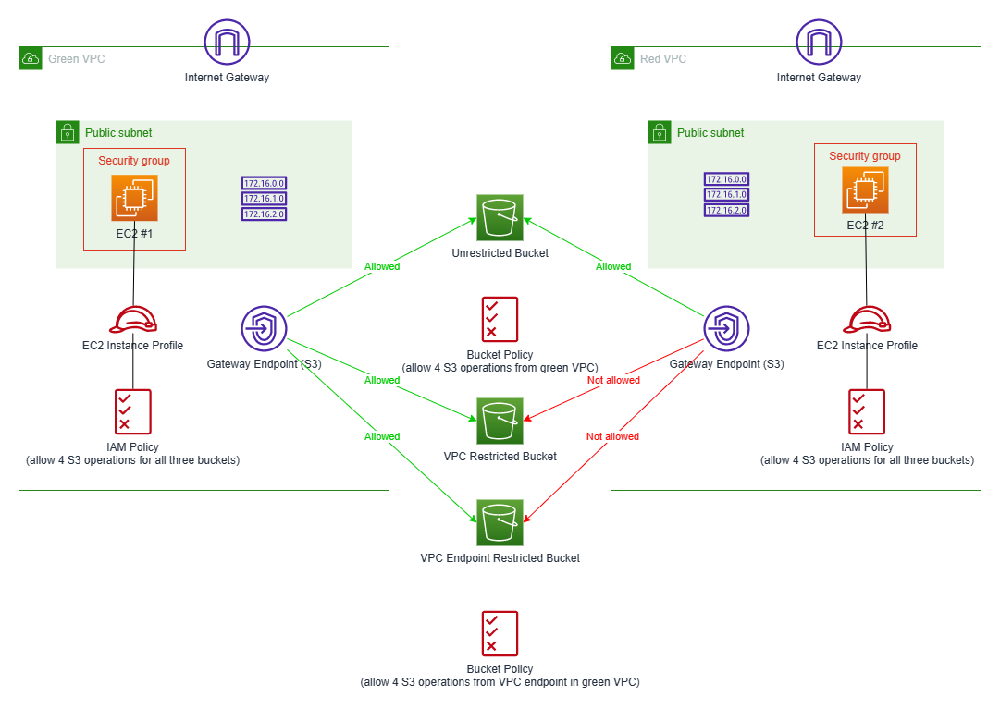

# VPC Endpoint Demo

## Introduction
Demonstration of VPC gateway endpoints (S3) and advanced IAM policies with conditions.

Two VPCs:
* One VPC named green which is granted access to restricted buckets (see below). 
* One VPC named red which is not granted access to the restricted buckets (see below). A gateway VPC endpoint (S3) is created in this VPC.
In each of the two VPCs, a public subnet and a gateway VPC endpoint for the S3 service is created.

Three S3 buckets with blocked public access:
* One without any bucket policy (i.e. access is not restricted to any VPC or VPC endpoint). The rest of this document uses the term unrestricted bucket to refer to this bucket.
* One with a bucket policy restricting access so that four operations (GetObject, PutObject, DeleteObject and ListBucket) are only allowed from the green VPC. In other words, any other operation is completely forbidden, and the four operations can only be triggered from the green VPC. The rest of this document uses the term VPC restricted bucket to refer to this bucket.
* One with a bucket policy restricting access so that four operations (GetObject, PutObject, DeleteObject and ListBucket) are only allowed via the VPC endpoint created in the green VPC. In other words, any other operation is completely forbidden, and the four operations can only be triggered via the VPC endpoint created in the green VPC. The rest of this document uses the term VPC endpoint restricted bucket to refer to this bucket.

In addition, the setup also involves two EC2 instances - one in the green VPC (green instance), one in the red VPC (red instance). Both EC2 instances have an IAM instance profile that allows the four above listed operations (GetObject, PutObject, DeleteObject and ListBucket) for all three S3 buckets. Both EC2 instances can perform the above listed operations for the unrestricted bucket. However, due to the bucket policies applied to the restricted S3 buckets, only the green instance can perform the above listed operations for the restricted buckets. The red instance will fail with access denied, despite of the permissions granted by its instance profile (the explicit denies defined in the bucket policies overrule the explicit allows in the instance profile).

The user data for the green instance involves several bash commands that create few files and uploads them to the S3 buckets. In other words, you can immediately start to list or download files. Before deleting the stack, the files should be removed from the S3 buckets. Otherwise, the deletion of the stack will fail.

The overall setup is depicted by the following diagram:


## Deployment
The deployment of the above described setup depends on resource(s) created by [Common-S3-Buckets](../Common-S3-Buckets) (e.g. S3 bucket for S3 access logs). Therefore, create that stack before you start the deployment of this demo. The following command can be used to deploy the VPC endpoint demo using the AWS CLI.
```
aws cloudformation create-stack --stack-name VPC-Endpoint-Demo --template-body file://cloud-formation-template.yml --parameters file://stack-params.json --capabilities CAPABILITY_NAMED_IAM --on-failure ROLLBACK
```

The CloudFormation template involves several parameters:
* The names for the three S3 buckets.
* The CIDR blocks for the two VPCs. These two parameters have default values.
* The AMI ID for the EC2 instances. This parameter has a default which ensures that the current AMI ID is taken from the SSM parameter store.

There are no defaults for the names of the S3 buckets, so these three parameters must be specified. The [stack-params.json](./stack-params.json) file contains the names for the three S3 buckets used during my experiments.
